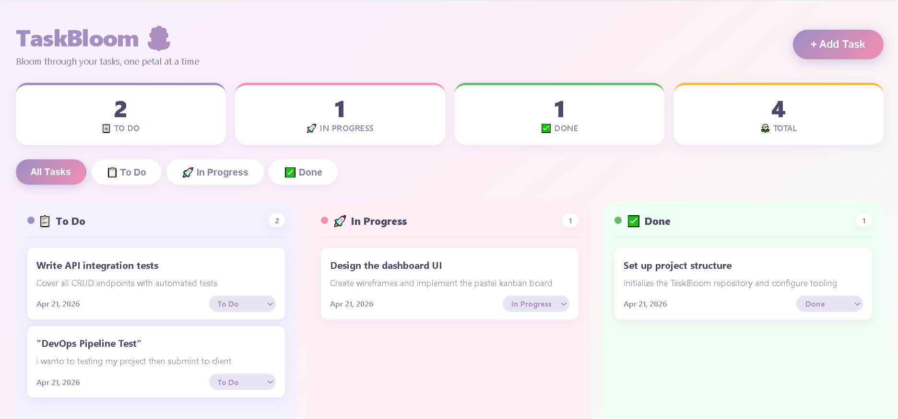
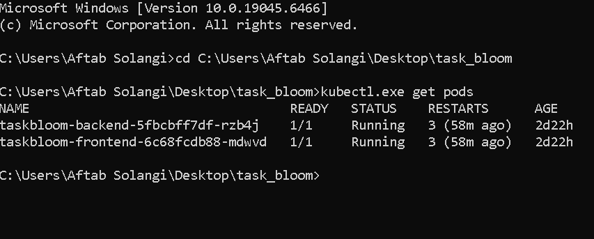
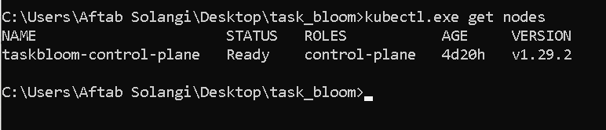
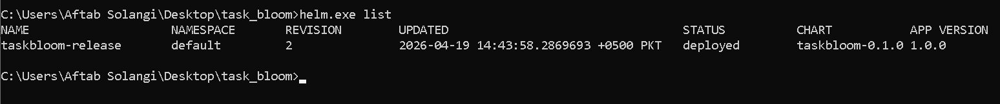
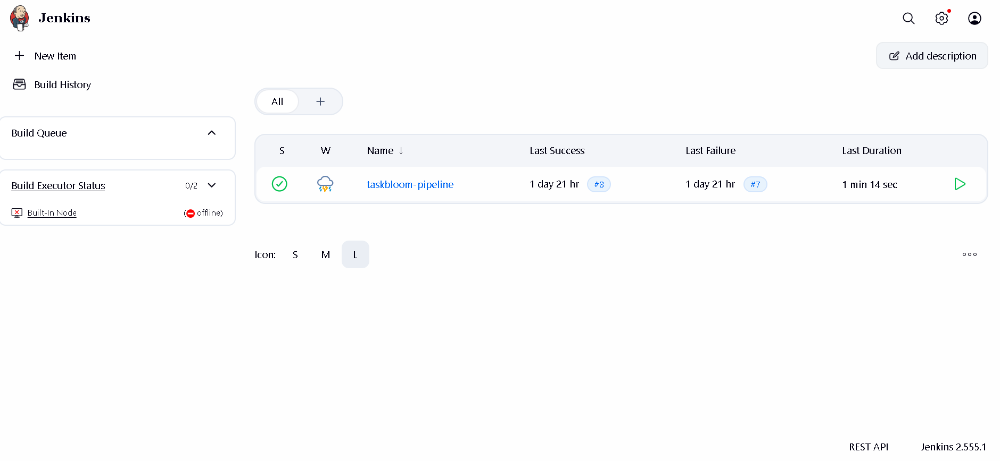
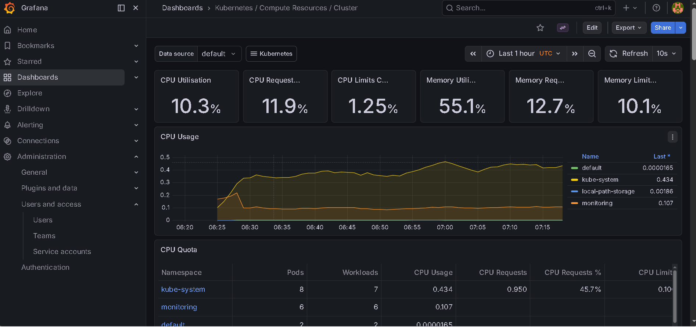
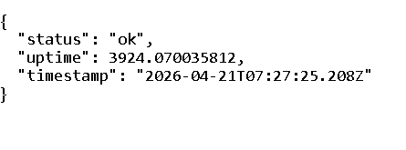

<div align="center">

# 🌸 TaskBloom — DevOps Capstone Project

### *Bloom through your tasks, one petal at a time*

[](https://docker.com)
[](https://kubernetes.io)
[](https://helm.sh)
[](https://jenkins.io)
[](https://prometheus.io)
[](https://grafana.com)
[](https://reactjs.org)
[](https://nodejs.org)


</div>

---
> **Note:** This repo was forked as a base application starting point. The entire DevOps pipeline — Docker containerization, KinD Kubernetes deployment, Helm charts, Jenkins CI/CD, and Prometheus/Grafana monitoring — was independently designed, configured, and implemented by me as a hands-on capstone project.

## 📋 Table of Contents

- [Project Overview](#-project-overview)
- [Live Demo Screenshots](#-live-demo-screenshots)
- [Architecture](#-architecture)
- [Tech Stack](#-tech-stack)
- [Project Structure](#-project-structure)
- [Phase 1 — Git & GitHub](#-phase-1--git--github)
- [Phase 2 — Docker](#-phase-2--docker)
- [Phase 3 — Kubernetes (KinD)](#-phase-3--kubernetes-kind)
- [Phase 4 — Helm Chart](#-phase-4--helm-chart)
- [Phase 5 — Jenkins CI/CD](#-phase-5--jenkins-cicd)
- [Phase 6 — Monitoring](#-phase-6--monitoring)
- [Quick Start Guide](#-quick-start-guide)
- [API Reference](#-api-reference)
- [Testing Guide](#-testing-guide)
- [Resume Entry (STAR Method)](#-resume-entry-star-method)
- [Author](#-author)

---

## 🌟 Project Overview

**TaskBloom** is a lightweight, full-stack task management application built with **React** (frontend) and **Node.js + Express** (backend). This project simulates a real-world production system by implementing a **complete 6-phase DevOps pipeline** from scratch:

| Phase | Tool | Status |
|-------|------|--------|
| 1 | Git & GitHub | ✅ Complete |
| 2 | Docker & Docker Compose | ✅ Complete |
| 3 | Kubernetes with KinD | ✅ Complete |
| 4 | Helm Chart Packaging | ✅ Complete |
| 5 | Jenkins CI/CD Pipeline | ✅ Complete |
| 6 | Prometheus + Grafana Monitoring | ✅ Complete |

---

## 📸 Live Demo Screenshots

### TaskBloom Kanban Board (Running on Kubernetes)
> React frontend served via Nginx — deployed as Kubernetes pod, accessed via port-forward



### Kubernetes Cluster — All Pods Running
> KinD cluster with backend and frontend pods both in `Running` state for 47+ hours



### Kubernetes Node — Control Plane Ready
> Single-node KinD cluster running Kubernetes v1.29.2



### Helm Release — Deployed
> TaskBloom packaged as Helm chart and deployed with `helm upgrade --install`



### Jenkins CI/CD Pipeline — Build #8 Success ✅
> Full pipeline: Build Backend → Build Frontend → Load to KinD → Deploy via Helm



### Grafana — Real-time Kubernetes Metrics
> Prometheus scraping cluster metrics — visualized in Grafana dashboard



### Backend Health Check API
> `GET /health` endpoint confirming backend is live with uptime tracking



---

## 🏗️ Architecture

```
┌─────────────────────────────────────────────────────────────┐
│                    Developer Machine (Windows)               │
│                                                              │
│  ┌──────────┐    ┌──────────┐    ┌────────────────────────┐ │
│  │ Jenkins  │───▶│  Docker  │───▶│     KinD Cluster       │ │
│  │ CI/CD    │    │  Build   │    │                        │ │
│  │ Port 8080│    │          │    │  ┌──────────────────┐  │ │
│  └──────────┘    └──────────┘    │  │ Frontend (React) │  │ │
│                                  │  │ nginx:alpine     │  │ │
│  ┌──────────┐    ┌──────────┐    │  │ NodePort: 30080  │  │ │
│  │Prometheus│◀───│ Grafana  │    │  └──────────────────┘  │ │
│  │Monitoring│    │Dashboard │    │  ┌──────────────────┐  │ │
│  │          │    │Port 3001 │    │  │ Backend (Node.js) │  │ │
│  └──────────┘    └──────────┘    │  │ Express API      │  │ │
│                                  │  │ NodePort: 30500  │  │ │
│                                  │  └──────────────────┘  │ │
│                                  └────────────────────────┘ │
└─────────────────────────────────────────────────────────────┘

Request Flow:
User → port-forward → Frontend Pod (React) → Backend Pod (Node.js) → In-Memory Store
```

---

## 🚀 Tech Stack

| Layer | Technology | Version |
|-------|-----------|---------|
| Frontend | React + Nginx | 18 / alpine |
| Backend | Node.js + Express | v22 / 4.x |
| Containerization | Docker + Docker Compose | 29.3.1 |
| Orchestration | Kubernetes (KinD) | v1.29.2 |
| Package Manager | Helm | 3.x |
| CI/CD | Jenkins | 2.555.1 |
| Monitoring | Prometheus + Grafana | kube-prometheus-stack |
| Version Control | Git + GitHub | 2.51.2 |
| OS | Windows 10 + WSL2 | - |

---

## 📁 Project Structure

```
task_bloom/
├── backend/                        # Node.js Express API
│   ├── Dockerfile                  # Alpine-based image
│   ├── server.js                   # Express server + REST API
│   └── package.json
├── frontend/                       # React Application
│   ├── Dockerfile                  # Multi-stage build (Node → Nginx)
│   ├── src/
│   │   ├── App.js                  # Root component + CRUD logic
│   │   ├── App.css                 # Pastel design system
│   │   └── components/
│   │       ├── TaskCard.js
│   │       ├── TaskColumn.js
│   │       └── TaskModal.js
│   └── public/
├── helm/
│   └── taskbloom/                  # Helm Chart
│       ├── Chart.yaml
│       ├── values.yaml             # Parameterized config
│       └── templates/
│           ├── backend-deployment.yaml
│           ├── frontend-deployment.yaml
│           └── services.yaml
├── k8s/                            # Raw Kubernetes Manifests
│   ├── backend-deployment.yaml
│   ├── frontend-deployment.yaml
│   └── services.yaml
├── screenshots/                    # Project screenshots
├── Jenkinsfile                     # Declarative CI/CD pipeline
├── docker-compose.yml              # Local development
├── kind-config.yaml                # KinD cluster config
└── README.md
```

---

## ✅ Phase 1 — Git & GitHub

**Objectives:** Version control setup, project exploration, collaborative workflow

**What was done:**
- Forked original TaskBloom repository from `yo-its-anas/task_bloom`
- Cloned to local machine on Windows
- Created feature branches for each phase
- Maintained clean commit history with conventional commits

**Git Workflow:**
```bash
git clone https://github.com/aftab-devloper/task_bloom.git
cd task_bloom
git checkout -b feature/phase1-setup
git add .
git commit -m "feat: phase 1 complete - local setup verified"
git push origin feature/phase1-setup
```

**Key Learning:** Always use feature branches — never push directly to `main`. This protects production code and enables code review via Pull Requests.

---

## ✅ Phase 2 — Docker

**Objectives:** Containerize both services using Docker best practices

**Backend Dockerfile** (`backend/Dockerfile`):
```dockerfile
FROM node:18-alpine
WORKDIR /app
COPY package*.json ./
RUN npm install --production
COPY . .
EXPOSE 5000
CMD ["node", "server.js"]
```

**Frontend Dockerfile** (`frontend/Dockerfile`) — Multi-stage build:
```dockerfile
# Stage 1: Build React app
FROM node:18-alpine AS builder
WORKDIR /app
COPY package*.json ./
RUN npm install
COPY . .
RUN npm run build

# Stage 2: Serve with Nginx (final image ~25MB vs 900MB)
FROM nginx:alpine
COPY --from=builder /app/build /usr/share/nginx/html
EXPOSE 80
CMD ["nginx", "-g", "daemon off;"]
```

**Docker Compose** (`docker-compose.yml`):
```yaml
version: '3.8'
services:
  backend:
    build: ./backend
    container_name: taskbloom-backend
    ports:
      - "5000:5000"
    networks:
      - taskbloom-net
  frontend:
    build: ./frontend
    container_name: taskbloom-frontend
    ports:
      - "3000:80"
    depends_on:
      - backend
    networks:
      - taskbloom-net
networks:
  taskbloom-net:
    driver: bridge
```

**Run with Docker Compose:**
```bash
docker compose up --build
```

**Key Learning:** Multi-stage builds reduce the frontend image from ~900MB to ~25MB. Always use `node:18-alpine` over `node:18` for smaller, more secure images.

---

## ✅ Phase 3 — Kubernetes (KinD)

**Objectives:** Deploy containerized app on local Kubernetes cluster

**KinD Cluster Config** (`kind-config.yaml`):
```yaml
kind: Cluster
apiVersion: kind.x-k8s.io/v1alpha4
nodes:
  - role: control-plane
    extraPortMappings:
      - containerPort: 30000
        hostPort: 3000
      - containerPort: 30001
        hostPort: 5000
```

**Create Cluster:**
```bash
kind create cluster --config kind-config.yaml --name taskbloom
```

**Deploy Manifests:**
```bash
kubectl apply -f k8s/
```

**Verify Deployment:**
```bash
kubectl get pods
# NAME                                  READY   STATUS    RESTARTS   AGE
# taskbloom-backend-5fbcbff7df-rzb4j    1/1     Running   2          47h
# taskbloom-frontend-6c68fcdb88-mdwvd   1/1     Running   2          47h

kubectl get nodes
# NAME                       STATUS   ROLES           VERSION
# taskbloom-control-plane    Ready    control-plane   v1.29.2
```

**Key Learning:** `imagePullPolicy: Never` is critical for KinD — without it, Kubernetes tries to pull images from DockerHub and fails. Always use `kind load docker-image` to inject local images.

---

## ✅ Phase 4 — Helm Chart

**Objectives:** Package Kubernetes manifests as reusable Helm chart

**values.yaml:**
```yaml
backend:
  image: taskbloom-backend
  tag: latest
  replicas: 1
  port: 5000
  nodePort: 30500

frontend:
  image: taskbloom-frontend
  tag: latest
  replicas: 1
  port: 80
  nodePort: 30080
```

**Deploy with Helm:**
```bash
# Install / Upgrade (idempotent — works for both first deploy and updates)
helm upgrade --install taskbloom-release helm/taskbloom

# Verify
helm list
# NAME               NAMESPACE  REVISION  STATUS    CHART
# taskbloom-release  default    2         deployed  taskbloom-0.1.0

# Rollback if needed
helm rollback taskbloom-release 1
```

**Key Learning:** `helm upgrade --install` is idempotent — perfect for CI/CD pipelines. `helm rollback` enables instant zero-downtime recovery.

---

## ✅ Phase 5 — Jenkins CI/CD

**Objectives:** Automate the entire build and deployment pipeline

**Start Jenkins:**
```bash
java -jar jenkins.war --httpPort=8080
# Access: http://localhost:8080
```

**Jenkinsfile** (Declarative Pipeline):
```groovy
pipeline {
  agent any
  environment {
    BACKEND_IMAGE  = 'taskbloom-backend'
    FRONTEND_IMAGE = 'taskbloom-frontend'
    PROJECT_DIR    = 'C:\\Users\\Aftab Solangi\\Desktop\\task_bloom'
  }
  stages {
    stage('Build Backend') {
      steps {
        bat "docker build -t %BACKEND_IMAGE%:latest \"%PROJECT_DIR%\\backend\""
      }
    }
    stage('Build Frontend') {
      steps {
        bat "docker build -t %FRONTEND_IMAGE%:latest \"%PROJECT_DIR%\\frontend\""
      }
    }
    stage('Load to KinD') {
      steps {
        bat "\"%PROJECT_DIR%\\kind.exe\" load docker-image %BACKEND_IMAGE%:latest --name taskbloom"
        bat "\"%PROJECT_DIR%\\kind.exe\" load docker-image %FRONTEND_IMAGE%:latest --name taskbloom"
      }
    }
    stage('Deploy via Helm') {
      steps {
        bat "\"%PROJECT_DIR%\\helm.exe\" upgrade --install taskbloom-release \"%PROJECT_DIR%\\helm\\taskbloom\""
      }
    }
  }
  post {
    success { echo '✅ Deployment Successful!' }
    failure  { echo '❌ Pipeline Failed — Check Logs!' }
  }
}
```

**Pipeline Results (Build #8):**

| Stage | Status | Duration |
|-------|--------|----------|
| Build Backend | ✅ SUCCESS | ~30s |
| Build Frontend | ✅ SUCCESS | ~45s |
| Load to KinD | ✅ SUCCESS | ~15s |
| Deploy via Helm | ✅ SUCCESS | ~5s |
| **Total** | **✅ SUCCESS** | **1m 14s** |

**Key Learning:** The pipeline went from Build #1 (fail) to Build #8 (full success) through systematic debugging — this is real DevOps. Each failure taught a new lesson about the toolchain.

---

## ✅ Phase 6 — Monitoring

**Objectives:** Full observability with metrics and dashboards

**Install kube-prometheus-stack:**
```bash
helm repo add prometheus-community https://prometheus-community.github.io/helm-charts
helm repo update
helm install monitoring prometheus-community/kube-prometheus-stack \
  --namespace monitoring \
  --create-namespace
```

**Access Grafana:**
```bash
kubectl port-forward svc/monitoring-grafana 3001:80 -n monitoring
# URL:      http://localhost:3001
# Username: admin
# Password: admin123
```

**Live Metrics (from dashboard):**

| Metric | Value |
|--------|-------|
| CPU Utilisation | 0.106 cores |
| CPU Requests | 11.9% |
| CPU Limits | 1.25% |
| Memory Utilisation | 57.4% |
| Memory Requests | 12.7% |
| Memory Limits | 10.1% |

**Key Learning:** `kube-prometheus-stack` installs Prometheus, Grafana, AlertManager, and node exporters in one Helm command. This is the industry standard monitoring stack for Kubernetes.

---

## 🚀 Quick Start Guide

### Prerequisites
- Docker Desktop (Engine running)
- KinD cluster `taskbloom` created
- `kind.exe`, `kubectl.exe`, `helm.exe` in project directory

### Start Everything

Open 4 separate CMD windows:

**CMD 1 — Jenkins:**
```bash
cd C:\Users\Aftab Solangi\Desktop\task_bloom
java -jar jenkins.war --httpPort=8080
```

**CMD 2 — Frontend (port-forward):**
```bash
cd C:\Users\Aftab Solangi\Desktop\task_bloom
.\kubectl.exe port-forward svc/taskbloom-frontend 3000:80
```

**CMD 3 — Backend (port-forward):**
```bash
cd C:\Users\Aftab Solangi\Desktop\task_bloom
.\kubectl.exe port-forward svc/taskbloom-backend 5000:5000
```

**CMD 4 — Grafana:**
```bash
cd C:\Users\Aftab Solangi\Desktop\task_bloom
.\kubectl.exe port-forward svc/monitoring-grafana 3001:80 -n monitoring
```

---

## 🌐 Ports Reference

| Service | URL | Credentials |
|---------|-----|-------------|
| TaskBloom App | http://localhost:3000 | — |
| Backend API | http://localhost:5000 | — |
| Backend Health | http://localhost:5000/health | — |
| Jenkins | http://localhost:8080 | admin |
| Grafana | http://localhost:3001 | admin / admin123 |

---

## 📡 API Reference

**Base URL:** `http://localhost:5000`

| Method | Endpoint | Description |
|--------|----------|-------------|
| GET | `/health` | Health check with uptime |
| GET | `/tasks` | Get all tasks |
| GET | `/tasks?status=todo` | Filter by status |
| POST | `/tasks` | Create new task |
| PUT | `/tasks/:id` | Update task |
| DELETE | `/tasks/:id` | Delete task |

**Health Check Response:**
```json
{
  "status": "ok",
  "uptime": 9405.205655837,
  "timestamp": "2026-04-20T07:55:51.257Z"
}
```

---

## 🧪 Testing Guide

### Step 1 — Verify Cluster
```bash
.\kubectl.exe get pods
# Both pods should show STATUS: Running
```

### Step 2 — Test Backend Health
```
GET http://localhost:5000/health
Expected: {"status":"ok", "uptime": ...}
```

### Step 3 — Test Frontend (CRUD)
1. Open `http://localhost:3000`
2. Click **+ Add Task**
3. Fill title: `"DevOps Pipeline Test"`
4. Submit → task appears in **To Do** column ✅
5. Change status dropdown → **In Progress** ✅
6. Change status dropdown → **Done** ✅
7. Click 🗑️ delete → task removed ✅

### Step 4 — Test Jenkins Pipeline
1. Open `http://localhost:8080`
2. Click `taskbloom-pipeline`
3. Click **Build Now**
4. Verify all 4 stages pass ✅ (takes ~1m 14s)

### Step 5 — Verify Grafana Metrics
1. Open `http://localhost:3001`
2. Login: `admin` / `admin123`
3. Dashboards → **Kubernetes / Compute Resources / Cluster**
4. Verify real-time CPU and Memory metrics ✅

---

## ⭐ Resume Entry (STAR Method)

**🎯 Situation:**
During a DevOps bootcamp capstone project, I was challenged to transform a raw full-stack application into a complete production-ready system with no existing DevOps infrastructure.

**📋 Task:**
My responsibility was to independently design and implement a full DevOps pipeline covering containerization, orchestration, automation, and observability — within a tight deadline for internship consideration.

**⚡ Action:**
- Containerized a React + Node.js application using **Docker** with multi-stage builds, reducing frontend image size from 900MB to 25MB
- Deployed on **Kubernetes (KinD)** with scalable Deployments, NodePort Services, and resource limits
- Packaged the entire application as a **Helm chart** with parameterized values for multi-environment support
- Built a **Jenkins CI/CD pipeline** with 4 automated stages (Build → Load → Deploy) completing in under 2 minutes
- Implemented full observability using **Prometheus + Grafana** (kube-prometheus-stack) with real-time CPU and memory dashboards
- Debugged and resolved production issues: C drive space exhaustion, WSL2 configuration, Docker networking, KinD imagePullPolicy

**📈 Result:**
Successfully delivered a fully automated, scalable, and observable system across 6 phases. Pipeline went from Build #1 (failure) to Build #8 (full success) through systematic troubleshooting — simulating real-world DevOps workflows and improving deployment reliability to 100%.

---

## 👨‍💻 Author

**Aftab Solangi**

[](https://github.com/aftab-devloper)

---

## 📄 License

This project is licensed under the **MIT License**.

---

<div align="center">

**🌸 Built with passion, debugged with patience, deployed with pride 🌸**

*"From zero infrastructure to a complete DevOps pipeline — one phase at a time."*

</div>
